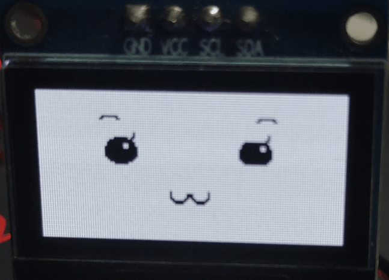

# ESP32_IDF-oled_driver
ESP32 IDF平台的OLED驱动文件，用于0.96英寸OLED显示表情。   


文件说明：   
oled_driver：OLED驱动文件  
oled_driver_test：测试工程

# 1 OLED驱动  
csdn博客：[esp32系列(9)：完成一个OLED的驱动](https://blog.csdn.net/lum250/article/details/123410607) 对应的源码 

显示效果：  
  

## 1.1 OLED驱动使用     

主要功能：实现OLED刷新不同的表情。  

1 需要在“oled_driver.h”中的宏定义中设置相关参数：  
```c  
#define OLED_I2C_SDA_IO 22          //I2C SDA GPIO Number   
#define OLED_I2C_SCL_IO 23          //I2C SCL GPIO Number    
#define OLED_I2C_POER_NUM 1         //OLED 使用的 I2C 驱动号
#define OLED_I2C_FREQ 400000        //OLED 对应 I2C 时钟  
#define OLED_ADDR 0x3c              //OLED I2C 器件地址    
```    

2 在函数中调用 oled_init() 进行OLED的初始化。  

3 调用其他 api 实现相关功能。   


# 1.2 主要api  
### 1.2.1 esp_err_t oled_init();  
- 功能：  
    初始化OLED。  
- 实现原理：  
    根据乐鑫的I2C驱动使用指南，对控制OLED的I2C外设进行初始化，配置为master模式、SDA和SCL线都上拉、I2C频率为400KHz。
- 注意：  
    需要在“oled_driver.h” 宏定义中设置相关参数   
- 返回：  
    - 1: i2c参数配置 i2c_param_config() 失败。  
    - 2: i2c驱动安装 i2c_driver_install() 失败。
    - 3: oled 初始化配置 i2c_master_write_slave() 失败。
    - 0/ESP_OK: oled初始化成功
- 参数：  
    无   

### 1.2.2 esp_err_t oled_set_start_address(uint8_t page_addr, uint16_t ram_addr);

- 功能：  
    设置显存刷新的起始地址，包括页地址和ram地址。   
- 实现原理：  
    将设置需要刷新显存的起始地址的控制字发送给OLED。  
- 注意：  
    无 
- 返回：  
    - 0/ESP_OK: 成功   
    - 其他：失败
- 参数：  
    - page_addr：页地址  
    - ram_addr：此页内的ram地址 

### 1.2.3 刷新一个page的显存  esp_err_t oled_page_refresh(uint8_t page_addr, uint8_t *buf);  

- 功能：  
    刷新一个page的显存  
- 实现原理：  
    设置好需要更新的page的起始地址后，将图像数据发送给oled。   
- 注意：  
    无 
- 返回：  
    - 0/ESP_OK: 成功   
    - 其他：失败
- 参数：  
    - page_addr：页地址  
    - buf, 图像数据  

### 1.2.4 刷新整个显存 esp_err_t oled_gddram_refresh(uint8_t *buf);  

- 功能：  
    刷新整个显存 Graphic Display Data RAM (GDDRAM)   
- 实现原理：  
    刷新所有page。   
- 返回：  
    - 0/ESP_OK: 成功   
    - 其他：失败
- 参数：    
    - buf, 图像数据    


### 1.2.5 esp_err_t oled_forehead_refresh(forehead_t forehead_expr, uint8_t frame_cnt);  
- 功能：  
    刷新额头范围（第1，2行）显存  
- 实现原理：  
    刷新 page0 和  page1。   
- 返回：  
    - 0/ESP_OK: 成功   
    - 其他：失败
- 参数：    
    - forehead_expr：额头的表情索引  
    - frame_cnt：刷新当前表情的帧索引   

### 1.2.6 esp_err_t oled_eyes_refresh(eyes_t eyes_expr, uint8_t frame_cnt);    
- 功能：  
    刷新眼睛范围（第3，4行）显存  
- 实现原理：  
    刷新 page2 和  page3。  
- 注意：  
    表情并没有全部实现   
- 返回：  
    - 0/ESP_OK: 成功   
    - 其他：失败
- 参数：    
    - eyes_expr：眼睛的表情索引  
    - frame_cnt：刷新当前表情的帧索引   
    - 
### 1.2.7 esp_err_t oled_nose_refresh(nose_t nose_expr, uint8_t frame_cnt);    

- 功能：  
    刷新鼻子范围（第5行）显存  
- 实现原理：  
    刷新 page4。  
- 注意：  
    表情并没有全部实现    
- 返回：  
    - 0/ESP_OK: 成功   
    - 其他：失败
- 参数：    
    - nose_expr：鼻子的表情索引  
    - frame_cnt：刷新当前表情的帧索引  
  
### 1.2.8 esp_err_t oled_mouth_refresh(mouth_t mouth_expr, uint8_t frame_cnt);    

- 功能：  
    刷新嘴巴范围（第6、7行）显存  
- 实现原理：   
    刷新 page5 和 page6。  
- 注意：  
    表情并没有全部实现     
- 返回：  
    - 0/ESP_OK: 成功   
    - 其他：失败
- 参数：    
    - mouth_expr：嘴巴的表情索引  
    - frame_cnt：刷新当前表情的帧索引  


### 1.2.9 esp_err_t oled_chin_refresh(chin_t chin_expr, uint8_t frame_cnt);    

- 功能：  
    刷新下巴范围（第8行）显存  
- 实现原理：   
    刷新 page7。  
- 注意：  
    表情并没有全部实现     
- 返回：  
    - 0/ESP_OK: 成功   
    - 其他：失败
- 参数：    
    - mouth_expr：下巴的表情索引  
    - frame_cnt：刷新当前表情的帧索引  

### 1.2.10 esp_err_t oled_refresh_expression(expression_t expression);

- 功能：  
    刷新整个表情    
- 实现原理：   
    逐个刷新各部位。   
- 注意：  
    表情并没有全部实现    
- 返回：  
    - 0/ESP_OK: 成功   
    - 其他：失败
- 参数：    
    - mouth_expr：下巴的表情索引  
    - frame_cnt：刷新当前表情的帧索引
